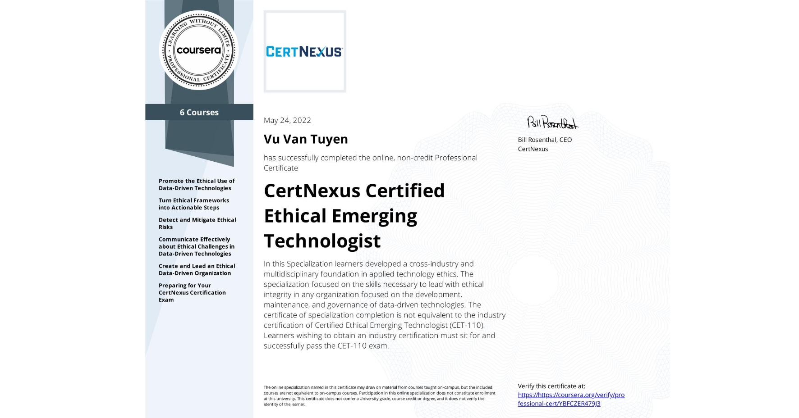
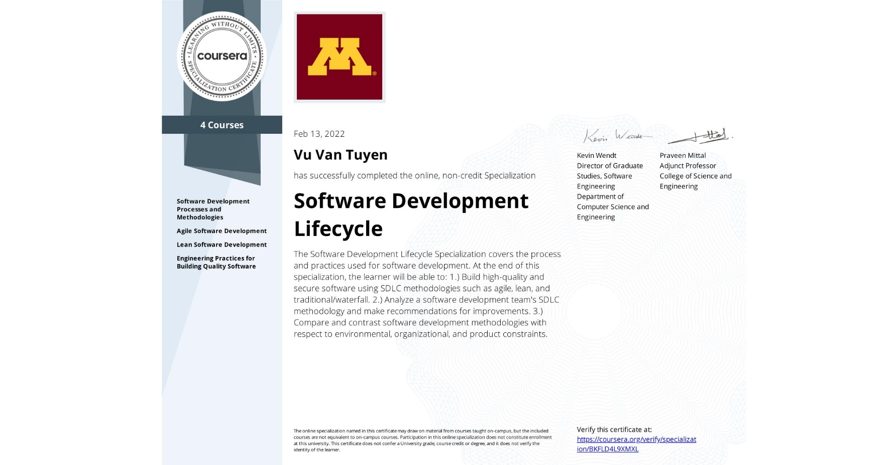
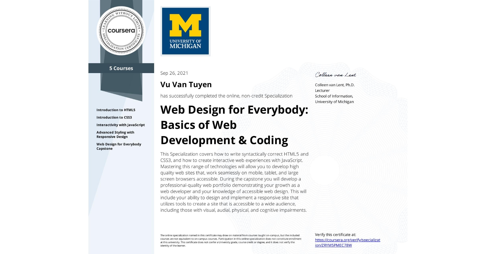
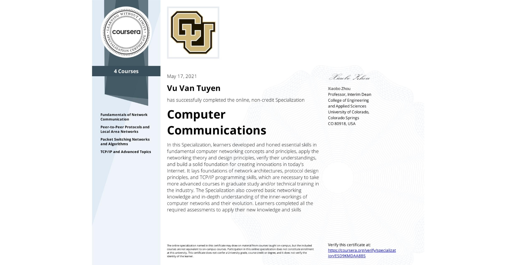

  

<h1 align="center">Hi, I'm Vu Van Tuyen </h1>

<h3 align="center">A passionate developer from Vietnam </h3>

   

<h2>About me  </h2>

- ✍ I'm a student of: [FPT University Hanoi](https://hanoi.fpt.edu.vn/) (FPTU).

- 🌱 I’m currently learning **Software Engineering.**
<h2> Languages  </h2>

  
  
  
  
          

<h2> How to reach me  </h2>

  
   
   
   
  
  

<h2> Skills </h2> 

  
  
    
  
  

<table style="width:100%;">
  <tr>
    <td>
      
      
    </td>
    <td>
      
 
        
      

    </td>
  </tr>
</table>

<h2> Certificates  </h2> 

  

  

  
  

  

